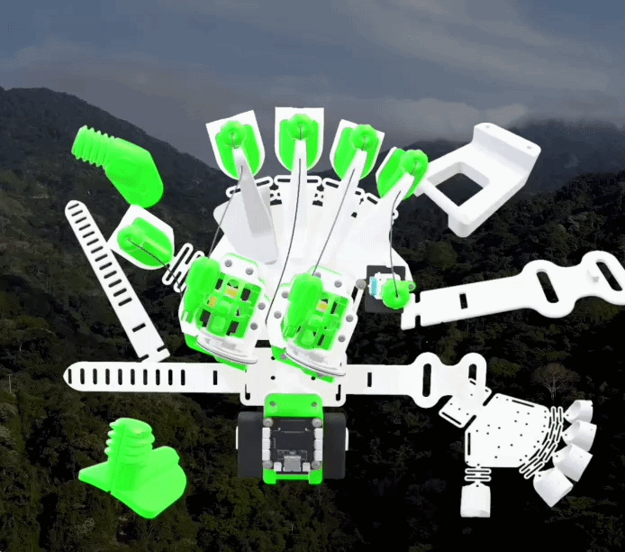

# Qolda-Rehab-System
Smart Rehabilitation Glove &amp; AI Web Ecosystem for Hand Motor Recovery
# 🥊 Qolda — Smart Rehabilitation Glove & AI Ecosystem

> **Инновационный программно-аппаратный комплекс для реабилитации мелкой моторики рук после инсультов и травм.**

🌐 **[ПОПРОБОВАТЬ ВЕБ-ПЛАТФОРМУ](https://qolda.onrender.com/)** 
🎥 **[СМОТРЕТЬ ПОЛНОЕ ВИДЕО РАБОТЫ НА YOUTUBE](https://www.youtube.com/watch?v=Zy11WWYYqtE)**

---

## 💡 О проекте Qolda

Qolda помогает восстанавливать моторику рук с помощью комбинации физического устройства и игровых тренажеров.

### Основные компоненты:
1. **Hardware Перчатка:** Механическая перчатка на базе MicroPython/Arduino. Фиксирует амплитуду и движения.
2. **Web-платформа:** Интерактивный лендинг, реабилитационные упражнения и отслеживание прогресса.
3. **ИИ Чат-бот:** Интеллектуальный ассистент прямо на сайте для ответов на вопросы пациента и рекомендаций.

---

## 📂 Структура репозитория

* `filmware/` — Прошивка для микроконтроллера (MicroPython/Arduino), схемы подключения.
* `web app/` — Исходный код веб-платформы, лендинга и ИИ чат-бота.
* `docs/` — Демонстрационные медиафайлы, GIF, фото и презентация.

---

## 🛠 Технологии
* **Hardware:** MicroPython / Arduino, Bluetooth / Serial
* **Frontend:** HTML5, CSS3, JavaScript
* **AI:** Gemini / OpenAI API
